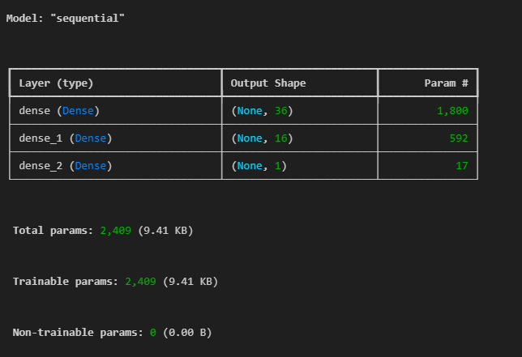
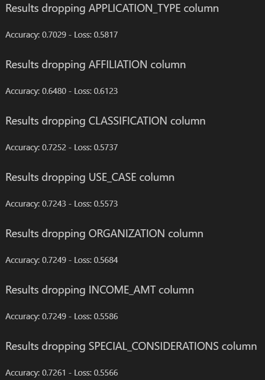
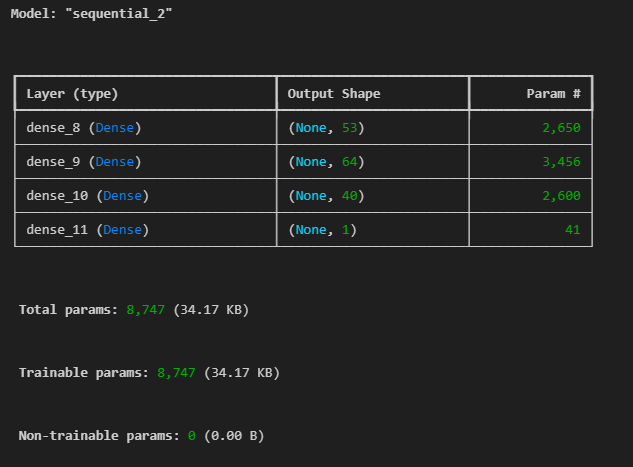

# Alphabet Soup Charity Deep Learning Analysis

## Purpose

The purpose of this analysis is to develop a predictive model that can assist the nonprofit foundation, Alphabet Soup, in selecting applicants for funding who are most likely to succeed in their ventures. Given the limited resources and the importance of maximizing the impact of their funding, Alphabet Soup aims to use this tool to make data-driven decisions, ensuring that their investments yield the highest possible success rates.

## Background

Alphabet Soup has provided a comprehensive dataset containing information on over 34,000 organizations that have received funding in the past. This dataset includes various features that capture essential metadata about each organization, such as:

### Target Variable

- **IS_SUCCESSFUL**: Indicator of whether the funding was used effectively.

### Feature Variables

- **EIN and NAME**: Identification columns.
- **APPLICATION_TYPE**: Type of application submitted to Alphabet Soup.
- **AFFILIATION**: Sector of industry the organization is affiliated with.
- **CLASSIFICATION**: Government classification of the organization.
- **USE_CASE**: The intended use for the requested funding.
- **ORGANIZATION**: Type of organization.
- **STATUS**: Current active status of the organization.
- **INCOME_AMT**: Income classification of the organization.
- **SPECIAL_CONSIDERATIONS**: Special considerations regarding the application.

## Data Preprocessing

1. Imported data into a Pandas DataFrame.
2. Dropped columns 'EIN' and 'NAME' as they were unique identifiers that did not contribute to the model.
3. Reviewed the contents of columns and the unique counts for each column.
4. Grouped outliers in the `APPLICATION_TYPE` column.
5. Grouped outliers in the `CLASSIFICATION` column.
6. Transformed all object-type columns using the `get_dummies` method.
7. Identified and split feature and target arrays.
8. Split processed data into training and testing datasets.
9. Scaled feature data.

### Data Preprocessing Questions

1. **What variable(s) are the target(s) for your model?**
   - The target variable is `IS_SUCCESSFUL`.

2. **What variable(s) are the features for your model?**
   - The feature variables include `APPLICATION_TYPE`, `AFFILIATION`, `CLASSIFICATION`, `USE_CASE`, `ORGANIZATION`, `STATUS`, `INCOME_AMT`, `SPECIAL_CONSIDERATIONS`, and `ASK_AMT`.

3. **What variable(s) should be removed from the input data because they are neither targets nor features?**
   - The columns `EIN` and `NAME` were removed as they are unique identifiers that do not contribute to the model.

## Initial Deep Learning Neural Model

1. Defined the sequential model.
2. First layer: 36 units, activation `relu`.
3. Second layer: 16 units, activation `relu`.
4. Output layer: 1 unit, activation `sigmoid`.

### Model Summary

### Compiling, Training, and Evaluating the Model

1. **How many neurons, layers, and activation functions did you select for your neural network model, and why?**
   - The initial model had 36 neurons in the first layer and 16 neurons in the second layer, both with `relu` activation functions. The output layer had 1 neuron with a `sigmoid` activation function. These choices were based on common practices for binary classification problems.

2. **Were you able to achieve the target model performance?**
   - No, the initial model did not achieve the target performance of 75% accuracy. It yielded an accuracy of 72.64%.

3. **What steps did you take in your attempts to increase model performance?**
   - Various approaches were tried to improve performance, including:
     - Removing different object-type feature columns.
     - Using Keras Tuner to search for the best hyperparameters.

### Results
The initial model yielded the following results:
- **Accuracy**: 0.7264
- **Loss**: 0.5579

## Model Optimization

### Amending grouping of Features: `APPLICATION_TYPE` and `CLASSIFICATION`

Changes were made to the grouping of outliers, where they were removed entirely, enlarged and reduced, which did not yield any more accuracy.

### Removal of Columns

For each object-type feature, I tried removing that column and running the same model with no gains in accuracy.

### Keras Tuner

Using the Keras Tuner, I ran through 448 trials, allowing the tuner to select and search for the best model. This yielded the following parameters:

- `activation`: `tanh`
- `first_units`: 53
- `num_layers`: 2
- `units_0`: 64
- `units_1`: 40
- `units_2`: 40
- `tuner/epochs`: 12
- `tuner/initial_epoch`: 0
- `tuner/bracket`: 2
- `tuner/round`: 0

### Optimized Model Summary 

### Results

- **Accuracy**: 0.7229
- **Loss**: 0.5535

## Summary

The deep learning model developed for Alphabet Soup did not achieve the target accuracy of 75%. Despite efforts to optimize the model by removing non-contributory columns and utilizing Keras Tuner to identify the best hyperparameters, the accuracy remained around 72%.

### Alternative Model Recommendation

To further improve the prediction accuracy, I recommend exploring different machine learning models such as Random Forests. Random Forests can be a suitable alternative to deep neural networks, particularly when dealing with tabular data, smaller datasets, or when interpretability and ease of use are essential considerations.
